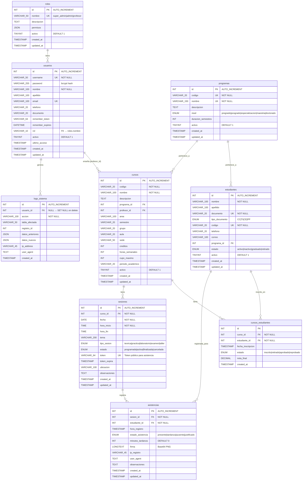

# Diagrama de Base de Datos — Sistema de Gestión de Asistencia

**Versión:** 1.0  
**Fecha:** 2026-06-04  
**Base de datos:** `asistencia_db` (MySQL 8.0)

---

## Diagrama Entidad-Relación (ERD)

> Renderizable en cualquier editor compatible con Mermaid (VS Code + extensión, GitHub, GitLab, Notion, etc.)



---

## Descripción de Relaciones

| Relación | Cardinalidad | Descripción |
|----------|-------------|-------------|
| `roles` → `usuarios` | 1:N | Un rol puede tener múltiples usuarios |
| `programas` → `cursos` | 1:N | Un programa puede tener múltiples cursos |
| `programas` → `estudiantes` | 1:N | Un programa puede tener múltiples estudiantes |
| `usuarios` → `cursos` | 1:N | Un profesor (usuario) puede tener múltiples cursos asignados |
| `cursos` ↔ `estudiantes` | N:M | Un curso tiene muchos estudiantes y un estudiante puede estar en muchos cursos (tabla pivote: `cursos_estudiantes`) |
| `cursos` → `sesiones` | 1:N | Un curso puede tener múltiples sesiones de clase |
| `sesiones` → `asistencias` | 1:N | Una sesión puede tener múltiples registros de asistencia |
| `estudiantes` → `asistencias` | 1:N | Un estudiante puede tener múltiples registros de asistencia |
| `usuarios` → `logs_sistema` | 1:N | Un usuario puede generar múltiples entradas de log |

---

## Índices Definidos

| Tabla | Columna(s) | Tipo | Propósito |
|-------|-----------|------|-----------|
| `usuarios` | `username` | UNIQUE | Búsqueda y unicidad de login |
| `usuarios` | `email` | UNIQUE | Unicidad de email |
| `usuarios` | `remember_token` | INDEX | Autenticación por cookie |
| `programas` | `codigo` | UNIQUE | Unicidad del código de programa |
| `programas` | `nombre` | UNIQUE | Unicidad del nombre de programa |
| `estudiantes` | `documento` | UNIQUE | Identificación del estudiante |
| `estudiantes` | `codigo` | UNIQUE | Código único de estudiante |
| `cursos` | `(codigo, grupo, periodo_academico)` | UNIQUE | Unicidad de sección de curso |
| `cursos` | `profesor_id` | INDEX | Búsqueda de cursos por profesor |
| `cursos` | `programa_id` | INDEX | Búsqueda de cursos por programa |
| `cursos_estudiantes` | `(curso_id, estudiante_id)` | UNIQUE | Previene inscripción duplicada |
| `sesiones` | `token` | UNIQUE | Acceso por token de sesión |
| `sesiones` | `(fecha, estado)` | INDEX | Búsqueda de sesiones activas por fecha |
| `asistencias` | `(sesion_id, estudiante_id)` | UNIQUE | Previene asistencia duplicada |
| `logs_sistema` | `(accion, created_at)` | INDEX | Consulta de logs por acción |

---

## Diagrama de Flujo de Datos Simplificado

```
ESTUDIANTE                          SISTEMA                         BD
    │                                  │                              │
    │── GET /asistencia?token=XXX ───►│                              │
    │                                  │── SELECT sesiones ──────────►│
    │                                  │◄── sesion activa ────────────│
    │◄── Formulario de registro ───────│                              │
    │                                  │                              │
    │── POST datos + firma ──────────►│                              │
    │                                  │── SELECT estudiantes ───────►│
    │                                  │── INSERT/UPDATE estudiante ─►│
    │                                  │── INSERT asistencia ─────────►│
    │                                  │── INSERT cursos_estudiantes ─►│
    │◄── Confirmación ─────────────────│                              │

PROFESOR                            SISTEMA                         BD
    │                                  │                              │
    │── POST crear sesión ───────────►│                              │
    │                                  │── generate token (hex32) ────│
    │                                  │── INSERT sesiones ──────────►│
    │◄── enlace con token ─────────────│                              │
    │                                  │                              │
    │── GET exportar ────────────────►│                              │
    │                                  │── SELECT asistencias JOIN ──►│
    │                                  │── generate Excel/PDF ────────│
    │◄── archivo descargado ───────────│                              │
```

---

## Notas de Diseño

1. **Soft Delete:** Las tablas `usuarios`, `estudiantes`, `programas` y `cursos` usan el campo `activo` para deshabilitar registros sin eliminarlos físicamente, preservando la integridad referencial y el historial de logs.

2. **Firma Digital:** El campo `firma` en `asistencias` almacena la imagen PNG de la firma en formato Base64 (LONGTEXT). No se almacena como archivo físico para simplificar el backup y la portabilidad.

3. **Token de Sesión:** El campo `token` en `sesiones` es generado con `bin2hex(random_bytes(32))` (64 caracteres hex). Es de un solo uso por sesión y puede regenerarse invalidando el anterior.

4. **Remember Token:** El campo `remember_token` en `usuarios` almacena el hash SHA-256 del token enviado en la cookie, nunca el token en claro.

5. **Auditoría:** La tabla `logs_sistema` usa `ON DELETE SET NULL` en `usuario_id` para conservar el historial aunque el usuario sea desactivado.
